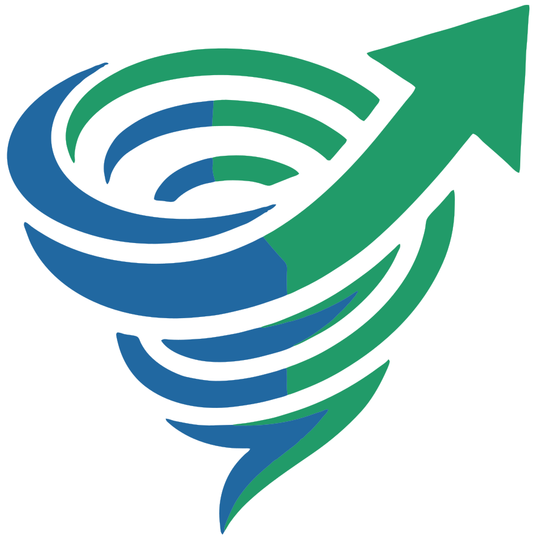
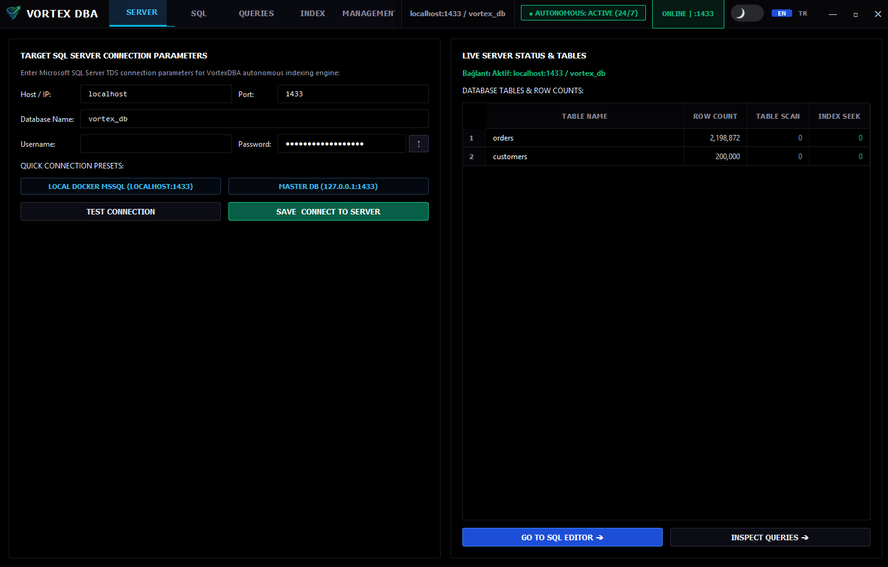
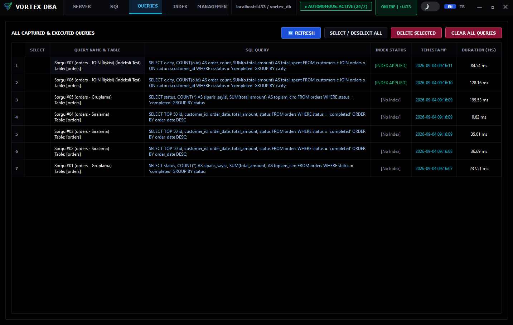
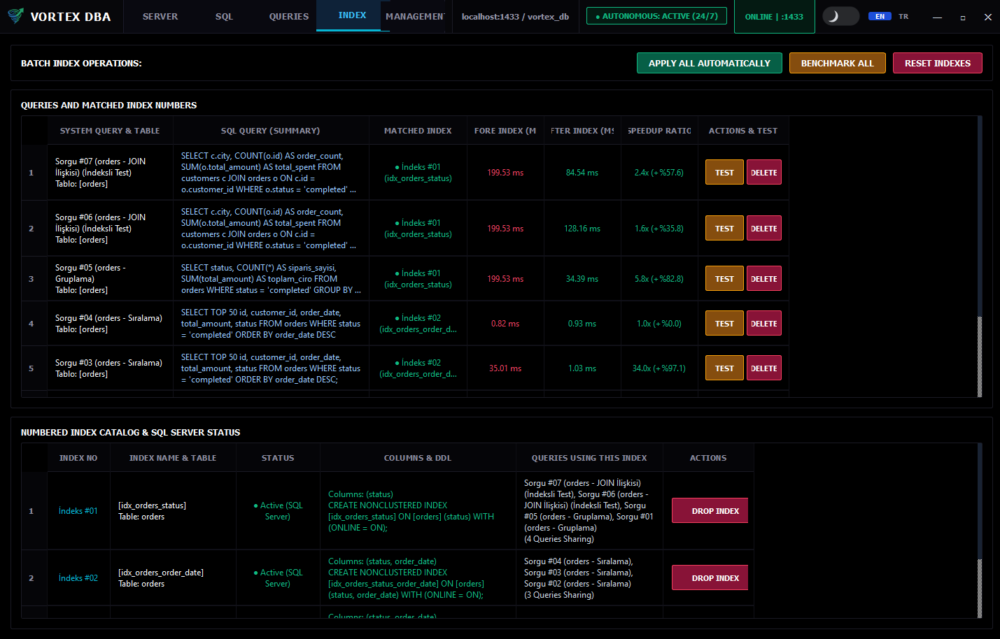
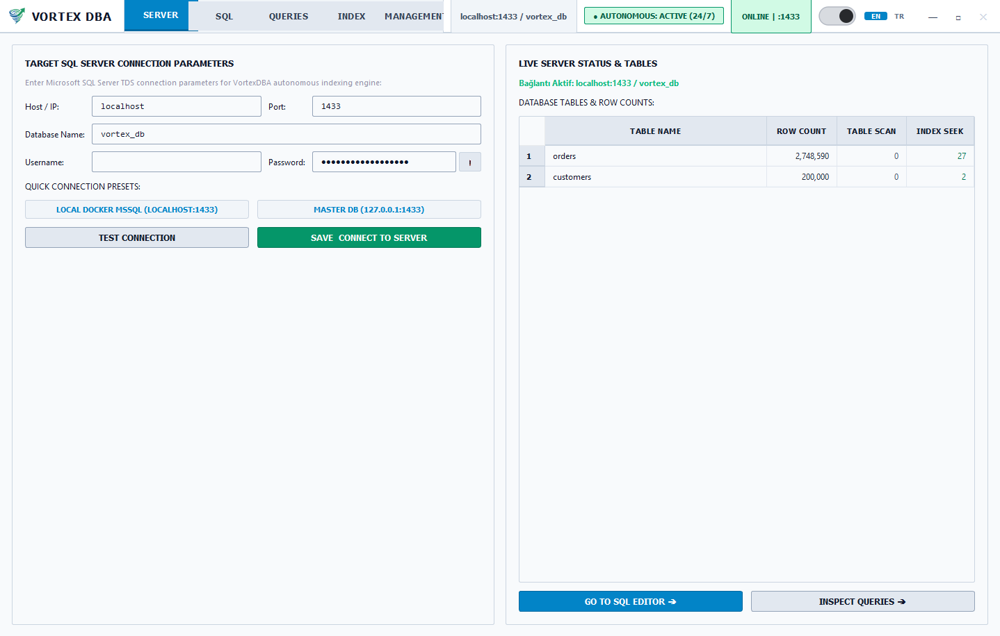

<p align="center">
  
</p>

<h1 align="center">VortexDBA</h1>

<p align="center">
  <strong>Autonomous SQL Server Performance Tuning and Index Optimization Engine</strong>
</p>

<p align="center">
  
  
  
  
  
</p>

---

## Overview

VortexDBA monitors SQL Server workloads, identifies slow queries from execution statistics, generates targeted index recommendations, tests those recommendations with before-and-after benchmarks, and automatically rolls back any change that degrades performance.

The engine can operate interactively through a native desktop interface, run as a continuous background daemon, or execute on demand through a command-line interface.

---

## Visual Tour

<!-- Add your application screenshots in this section -->

<p align="center">
  
  <br />
  <em>Main Dashboard</em>
</p>

<table align="center">
  <tr>
    <td width="50%" align="center">
      
      <br />
      <em>Query Discovery</em>
    </td>
    <td width="50%" align="center">
      
      <br />
      <em>Active and Unused Index Inventory</em>
    </td>
  </tr>
  <tr>
    <td colspan="2" align="center">
      
      <br />
      <em>Light Theme</em>
    </td>
  </tr>
</table>

---

## Key Capabilities

- **Real-Time Workload Capture**  
  Polls SQL Server Dynamic Management Views without profiler overhead to discover high-impact queries, total execution time, and call frequencies while ignoring internal system noise.

- **Non-Clustered Index Advisor**  
  Analyzes query predicates, join columns, equality conditions, range boundaries, and sort requirements to produce concrete non-clustered index statements with included columns.

- **Controlled Benchmarking and Automatic Rollback**  
  Executes isolated runs before and after applying an index. If latency degrades beyond the configured threshold, the index is dropped immediately to prevent production slowdowns.

- **Unused Index Detection**  
  Queries cumulative seek and scan statistics to detect dormant indexes that consume disk storage and introduce write penalties during insert, update, and delete workloads.

- **Safety Guardrails**  
  Enforces per-table index limits, maximum global index quotas, minimum cooldown intervals between structural changes, and dry-run defaults.

- **Cross-Interface Operations**  
  Includes a standalone PyQt6 desktop application with dark and light themes, an HTTP web dashboard for remote inspection, and a scriptable CLI.

- **Multi-Language Support**  
  Built-in support for English and Turkish with instant runtime toggling.

---

## How It Works

```
 ┌──────────────────────┐
 │   SQL Server DMVs    │  sys.dm_exec_query_stats
 └──────────┬───────────┘
            │
            ▼
 ┌──────────────────────┐
 │   Query Discovery    │  Captures high-cost user statements, ignores system noise
 └──────────┬───────────┘
            │
            ▼
 ┌──────────────────────┐
 │    Index Advisor     │  Synthesizes CREATE NONCLUSTERED INDEX statements
 └──────────┬───────────┘
            │
            ▼
 ┌──────────────────────┐
 │     Safety Guard     │  Validates quotas, table limits, and cooldown timers
 └──────────┬───────────┘
            │
            ▼
 ┌──────────────────────┐
 │ Baseline Benchmark   │  Records pre-optimization query duration
 └──────────┬───────────┘
            │
            ▼
 ┌──────────────────────┐
 │  Apply Index to DB   │  Deploys index schema changes
 └──────────┬───────────┘
            │
            ▼
 ┌──────────────────────┐
 │ Verification Bench   │  Measures post-optimization performance
 └──────────┬───────────┘
            │
      ┌─────┴────────────────┐
      ▼                      ▼
[ Improved ]           [ Degraded ]
Retain Index           Auto Rollback: DROP INDEX
Log Decision           Record Audit History
```

---

## Prerequisites

- Python 3.10 or newer
- Microsoft SQL Server 2016, 2019, 2022, or Azure SQL
- Operating System: Windows 10/11, Windows Server, or Linux

---

## Installation

1. **Clone the repository:**
   ```bash
   git clone https://github.com/samet-project/VortexDBA.git
   cd VortexDBA
   ```

2. **Create and activate a virtual environment:**
   ```bash
   python -m venv venv
   # On Windows
   venv\Scripts\activate
   # On Linux/macOS
   source venv/bin/activate
   ```

3. **Install dependencies:**
   ```bash
   pip install -r requirements.txt
   ```

4. **Prepare configuration:**
   Review and adjust `config.yaml` with your target database connection details:
   ```yaml
   operating_mode: advisor
   traffic_source: simulation
   language: en

   database:
     host: localhost
     port: 1433
     dbname: your_database
     user: sa
     password: YourPassword123!

   detection:
     min_mean_exec_time_ms: 50
     min_total_exec_time_ms: 1000
     min_calls: 5

   remediation:
     enabled: true
     dry_run_default: true
     max_indexes_per_table: 5
     max_indexes_total: 20
     cooldown_minutes: 60

   benchmark:
     runs: 3
     degradation_threshold_pct: 10.0
     improvement_threshold_pct: 5.0
   ```

---

## Running VortexDBA

### 1. Native Desktop GUI

Launch the desktop interface:
```bash
python app.py
```

The desktop app provides:
- Live database connection status and server latency monitor.
- Workload generator and direct SQL console.
- Real-time captured slow query table with selection actions.
- Candidate index drawer with one-click creation, benchmark, and rollback controls.
- Theme switch between dark and light modes.
- Language switcher between English and Turkish.

### 2. Web Dashboard

Launch the browser-based dashboard on port 8050:
```bash
python src/cli.py ui --port 8050
```
Open `http://localhost:8050` in your web browser.

### 3. Command-Line Interface

Execute operational tasks directly from the terminal:

- **Run analysis pipeline:**
  ```bash
  python src/cli.py analyze
  ```

- **Run auto-remediation with benchmarks:**
  ```bash
  # Dry-run without altering schemas
  python src/cli.py remediate --dry-run

  # Apply recommendations with automatic rollback if degraded
  python src/cli.py remediate --runs 3 --threshold 10.0
  ```

- **Inspect unused indexes:**
  ```bash
  # View all unused indexes
  python src/cli.py unused-indexes

  # Generate DROP INDEX scripts for unused indexes
  python src/cli.py unused-indexes --sql
  ```

- **Check safety guardrails status:**
  ```bash
  python src/cli.py safety-report
  ```

- **Run background self-healing agent:**
  ```bash
  # Single run
  python src/cli.py agent --once

  # Continuous daemon loop
  python src/cli.py agent --daemon
  ```

### 4. Docker Deployment

Deploy using Docker Compose:
```bash
docker compose up -d --build
```

---

## Building a Standalone Windows Executable

To bundle VortexDBA into a standalone executable:
```bash
python build_exe.py
```
The output is written to `dist/VortexDBA/VortexDBA.exe`. The build script bundles all PyQt6 modules, QtAwesome font resources, SVG graphics, and SQLite storage paths.

---

## Project Structure

```
VortexDBA/
├── app.py                 # Desktop application entry point
├── build_exe.py           # PyInstaller packaging configuration
├── config.yaml            # Engine and database configuration
├── docker-compose.yml     # Containerized execution setup
├── Dockerfile             # Container image specification
├── logo.svg               # Application vector logo
├── requirements.txt       # Python package dependencies
├── data/                  # Persistent SQLite tracking database
├── logs/                  # Application runtime logs
└── src/
    ├── auto_remediator.py # Index application, evaluation, and rollback logic
    ├── benchmark.py       # Isolated execution timing and plan comparisons
    ├── cli.py             # Command-line interface dispatcher
    ├── config.py          # Configuration loader with frozen path support
    ├── data_generator.py  # Synthetic schema and workload generator
    ├── db_connection.py   # SQL Server connection helper and health checks
    ├── index_advisor.py   # SQL parser and non-clustered index generator
    ├── query_discovery.py # Dynamic Management View query sniffer
    ├── safety_guard.py    # Policy verification and quota manager
    ├── state_store.py     # SQLite persistence layer for audit trails
    ├── gui/
    │   ├── main_window.py # Main desktop interface
    │   ├── theme.py       # High-contrast dark and light stylesheets
    │   ├── widgets/       # Metric cards, steppers, and dialogs
    │   └── dialogs/       # Connection dialogs and index preview drawers
    └── web_app.py         # FastAPI web server and templates
```

---

## Safety and Guardrail Rules

- **Quota Enforcement**: Hard limit on the number of indexes permitted per table and globally across the target database.
- **Degradation Detection**: Rollback triggers automatically if post-index average latency increases beyond `degradation_threshold_pct`.
- **System Isolation**: Statements referencing `sys`, `master`, `msdb`, `tempdb`, `information_schema`, and internal stored procedures are filtered out.
- **Non-Destructive Defaults**: New installations operate with `dry_run_default: true` until explicitly switched to active mode.

---

## License

This project is licensed under the MIT License. See [LICENSE](LICENSE) for details.
